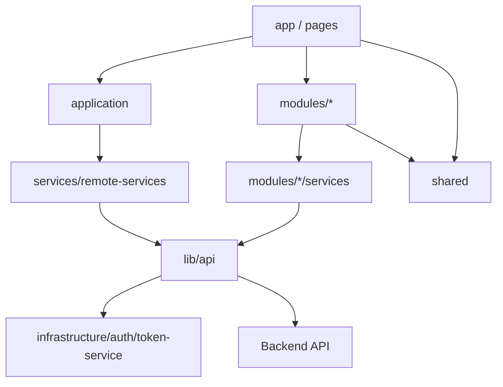

# بنية المشروع (WMS Architecture)

هذا المستند يصف هيكل **TreadX Warehouse Management System** الحالي: الطبقات، المجلدات، وكيفية إضافة ميزات جديدة.

---

## نظرة عامة

المشروع مبني على **Next.js 16 (App Router)** مع فصل بين:

- **Presentation**: الصفحات والمكوّنات (`app/`, `components/ui`, `shared/components`).
- **Application**: حالات الاستخدام العابرة للوحدات (use-cases) — حالياً المصادقة بشكل أساسي.
- **Modules**: ميزات المجال (موظفين، هيكل المستودع، المستخدم) مع `components` / `hooks` / `services` / `types` / `lib`.
- **Infrastructure & Lib**: التوكن، عميل HTTP (Axios)، معالجة الأخطاء.
- **Services**: تعريف الـ endpoints وأنواع الطلبات/الاستجابات المشتركة، وخدمات المصادقة عن بُعد.



---

## هيكل المجلدات

```
src/
├── app/                         # Next.js App Router (Presentation)
│   ├── (auth)/                  # مجموعة مسارات المصادقة
│   │   ├── _components/         # غلاف وصفحات المصادقة المشتركة
│   │   ├── login/               # /login
│   │   ├── register/            # /register
│   │   ├── forgot-password/     # /forgot-password
│   │   └── auth/                # /auth → إعادة توجيه إلى /login
│   ├── dashboard/               # لوحة التحكم (محمية بالـ proxy والصلاحيات)
│   │   ├── warehouse-structure/
│   │   ├── employees/
│   │   ├── inbound-sessions/
│   │   ├── outbound-sessions/
│   │   ├── inventory/
│   │   ├── stock/
│   │   ├── products/
│   │   ├── orders/
│   │   ├── reports/
│   │   └── profile/             # الإعدادات / الملف الشخصي
│   ├── 403/                     # صفحة ممنوع
│   ├── layout.tsx
│   └── page.tsx                 # توجيه إلى /login
├── application/                 # Use-Cases (منطق تطبيقي عابر)
│   └── auth/
│       ├── login.use-case.ts
│       ├── logout.use-case.ts
│       ├── register.use-case.ts
│       ├── forgot-password.use-case.ts
│       ├── change-password.use-case.ts
│       ├── refresh-access-token.use-case.ts
│       └── sync-user-session.use-case.ts
├── modules/                     # وحدات المجال (Feature modules)
│   ├── employees/               # إدارة موظفي المستودع
│   ├── warehouse-structure/     # تهيئة وهيكل المستودع + التصور
│   └── user/                    # ملف المستخدم الحالي (/me)
│       # كل وحدة عادةً تحتوي:
│       # components/  hooks/  services/  types/  lib/
├── infrastructure/
│   └── auth/
│       └── token-service.ts     # قراءة/كتابة التوكنات والكوكي
├── services/
│   ├── endpoints.ts             # مسارات الـ API المركزية
│   ├── remote-services/auth/    # استدعاءات Auth للـ Backend
│   └── types/                   # GeneralRequest/Response, Pagination, …
├── shared/                      # مشترك بين الطبقات
│   ├── components/              # Sidebar، ثيم، لغة، مكوّنات 3D، …
│   ├── config/                  # roles, permissions, warehouse-zones
│   ├── hooks/
│   ├── lib/
│   ├── stores/                  # auth-store (Zustand)
│   └── types/
├── components/ui/               # مكوّنات UI عامة (shadcn/Radix)
├── constants/
│   └── routes.ts                # مسارات الواجهة
├── lib/
│   ├── api.ts                   # Axios client + refresh على 401
│   ├── public-api.ts
│   ├── api-error.ts
│   └── …
├── providers/
│   └── query-provider.tsx       # TanStack React Query
├── schemas/                     # مخططات التحقق (مثل auth)
├── i18n/                        # next-intl
├── stories/                     # Storybook
└── proxy.ts                     # حماية المسارات (Next.js Proxy)
```

الترجمة في الجذر: `messages/ar.json` و `messages/en.json`.

---

## طبقة Modules

الميزات المنفّذة حالياً تُنظَّم تحت `src/modules/<feature>/`:

| الوحدة | المسؤولية |
|--------|-----------|
| **employees** | قائمة الموظفين، إنشاء/تعديل/حذف، تغيير الحالة |
| **warehouse-structure** | تهيئة المستودع، التصفح الهرمي (zones → rows → racks → slots → positions)، إحصاءات الإشغال |
| **user** | جلب وتخزين ملف `/users/me`، مزامنة الجلسة |

النمط المعتاد داخل الوحدة:

1. **types** — نماذج المجال وطلبات الـ API.
2. **services** — استدعاءات HTTP عبر `@/lib/api` و`ENDPOINTS`.
3. **lib** — تحويل DTO / أدوات مساعدة.
4. **hooks** — React Query أو منطق واجهة يستهلك الـ services.
5. **components** — واجهة الوحدة؛ الصفحة في `app/dashboard/...` تكون رقيقة وتستورد محتوى الوحدة.

---

## الميزات المدمجة

| الميزة | الوصف |
|--------|--------|
| **Auth** | تسجيل دخول/خروج، تسجيل، نسيت كلمة المرور، تغيير كلمة المرور، تجديد access token، مزامنة الجلسة من `/users/me`. التوكنات عبر `token-service` والكوكي (`refresh-token`, `user-role`). |
| **Permissions (RBAC)** | أدوار `admin` / `supplier` / `user`؛ خريطة مسارات في `shared/config/permissions.ts`؛ حماية في `proxy.ts`؛ قائمة جانبية حسب الصلاحية. |
| **Warehouse** | تهيئة هيكل المستودع وتصوره (بما في ذلك مكوّنات 3D تحت `shared/components/3d`). |
| **Employees** | إدارة طاقم المستودع عبر API الـ WMS. |
| **Localization** | عربي / إنجليزي من كوكي `NEXT_LOCALE`، RTL، ملفات `messages/`. |
| **Themes** | فاتح / غامق / نظام عبر next-themes. |
| **Data fetching** | TanStack React Query عبر `QueryProvider`. |
| **Layout** | `/` → `/login`؛ لوحة التحكم مع Sidebar (قائمة + ثيم + لغة + تسجيل خروج). |

---

## إضافة Feature جديدة

### أ) وحدة مجال (مفضّل للميزات الكبيرة)

1. أنشئ `src/modules/<feature>/` بالمجلدات: `types`, `services`, `lib`, `hooks`, `components`.
2. أضف الـ endpoints في `src/services/endpoints.ts`.
3. نفّذ الـ service باستخدام `api` من `@/lib/api`.
4. اربط الصفحة تحت `src/app/dashboard/<feature>/page.tsx` بمكوّنات الوحدة.
5. حدّث `src/constants/routes.ts` و`src/shared/config/permissions.ts` (و`NAV_ENTRIES` إن لزم).
6. أضف مفاتيح الترجمة في `messages/ar.json` و `messages/en.json`.

### ب) Use-Case في طبقة Application

مناسب لمنطق عابر للوحدات (مثل تدفق المصادقة):

1. أنشئ `src/application/<area>/<action>.use-case.ts`.
2. صدّر دالة غير متزامنة بمدخلات واضحة.
3. استدعِ الخدمات من `services/remote-services` أو وحدات أخرى، واستخدم `@/lib/api` عند الحاجة.
4. استدعِ الـ use-case من الصفحة أو من مكوّن عميل.

---

## Proxy (حماية المسارات)

الملف `src/proxy.ts` يحمي حركة الطلبات:

- بدون `refresh-token` + مسار يبدأ بـ `/dashboard` → توجيه إلى `/login`.
- مع توكن + مسار `/login` أو `/register` → توجيه إلى `/dashboard`.
- مع توكن + مسار dashboard دون صلاحية للدور → توجيه إلى `/403`.

المسارات في `config.matcher`: `/dashboard/:path*`, `/login`, `/register`.

الصلاحيات تُقرأ من كوكي `user-role` عبر `parseRole` و`canAccess`.

---

## تدفق البيانات (ملخص)

1. الصفحة / المكوّن يستدعي hook من الوحدة أو use-case من `application`.
2. الـ hook/service يستدعي `api` (`src/lib/api.ts`) مع مسار من `ENDPOINTS`.
3. عند 401، يحاول العميل تجديد الـ access token ثم إعادة الطلب؛ عند الفشل يُصفَّى الجلسة.
4. حالة المصادقة في الواجهة تُحفظ في `shared/stores/auth-store` (Zustand).

---

## ملاحظات

- **Domain منفصلة**: لا يوجد مجلد `src/domain/` حالياً؛ نماذج المجال تعيش داخل كل module تحت `types/`. عند الحاجة لفصل أوضح يمكن استخراج entities مشتركة لاحقاً.
- **صفحات placeholder**: بعض مسارات الـ dashboard (مثل products، orders، reports) موجودة كصفحات؛ المنطق الكامل يُضاف تدريجياً كوحدات تحت `modules/`.
- **store القديم**: `src/store/authStore.ts` فارغ؛ المصدر المعتمد للجلسة هو `src/shared/stores/auth-store.ts`.
- **متغيرات البيئة**: انظر `.env.example` و README (`NEXT_PUBLIC_BACKEND_URL_FOR_CLIENT_REQUESTS` / `…_SERVER_REQUESTS`).
