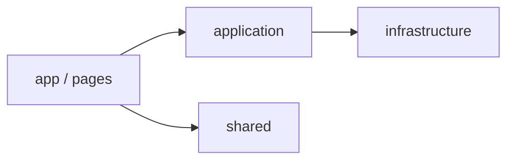

# بنية المشروع (Base Project Architecture)

هذا المستند يصف هيكل المشروع وكيفية استخدامه كقاعدة لمشاريع جديدة. الطبقة **Domain** غير مُنفّذة في هذا الـ Base؛ يمكن إضافتها لاحقاً عند تعريف مجالات العمل (مثل المنتجات، الطلبات).

---

## نظرة عامة

المشروع مبني على **Next.js (App Router)** مع فصل بين:

- **Presentation**: الصفحات والمكوّنات (`app/`, `components/`, `shared/`).
- **Application**: حالات الاستخدام (use-cases) مثل تسجيل المستخدم.
- **Infrastructure**: التوكن، الـ HTTP client، الـ proxy لحماية المسارات.



---

## هيكل المجلدات

```
src/
├── app/                    # Next.js App Router (Presentation)
│   ├── (auth)/             # مجموعة مسارات المصادقة
│   │   ├── auth/           # صفحة تسجيل الدخول (/auth)
│   │   └── register/       # صفحة التسجيل (/register)
│   ├── dashboard/          # لوحة التحكم (محمية بالصلاحيات)
│   ├── 403/                # صفحة ممنوع
│   ├── layout.tsx
│   └── page.tsx            # توجيه إلى /auth
├── application/            # طبقة التطبيق (Use-Cases)
│   └── auth/
│       └── register.use-case.ts
├── infrastructure/         # التنفيذات التقنية
│   ├── auth/
│   │   └── token-service.ts
│   └── http/
│       └── api-client.ts
├── shared/                 # مشترك بين الطبقات
│   ├── components/         # مكوّنات قابلة لإعادة الاستخدام
│   ├── config/             # الصلاحيات والأدوار
│   ├── hooks/
│   └── stores/
├── constants/              # المسارات والثوابت
├── i18n/                   # الترجمة (next-intl)
├── providers/
├── services/               # Endpoints وأنواع الطلبات (يمكن توحيدها لاحقاً)
└── proxy.ts                # حماية المسارات (Next.js Proxy)
```

---

## الميزات المدمجة

| الميزة | الوصف |
|--------|--------|
| **Auth** | تسجيل دخول (محاكاة)، تسجيل مستخدم جديد، تخزين التوكن والدور في الكوكي. |
| **Permissions (RBAC)** | أدوار (admin, supplier, user)، صلاحيات مسارات، حماية في الـ proxy، قائمة جانبية حسب الصلاحية. |
| **Localization** | عربي / إنجليزي من كوكي `NEXT_LOCALE`، RTL، ملفات `messages/ar.json` و `messages/en.json`. |
| **Themes** | فاتح / غامق / نظام عبر next-themes، مبدّل في الـ Sidebar. |
| **Layout** | الصفحة الرئيسية تُوجّه إلى `/auth`. لوحة التحكم مع Sidebar ثابت (قائمة + ثيم + لغة + تسجيل خروج). |

---

## إضافة Feature جديدة (بدون Domain)

1. **المسارات**: أضف المسارات في `src/constants/routes.ts`.
2. **الصلاحيات**: إن كانت الصفحة داخل الـ dashboard، حدّث `src/shared/config/permissions.ts` (خريطة المسارات لكل دور).
3. **Use-Case (اختياري)**: أنشئ ملفاً في `src/application/<feature>/` يستدعي الـ API أو المنطق، واستخدمه من الصفحة.
4. **الصفحات**: أنشئ الصفحة تحت `src/app/dashboard/...` أو تحت مسار آخر، واستخدم المكوّنات من `@/components/ui` أو `@/shared/components`.
5. **الترجمة**: أضف المفاتيح في `messages/ar.json` و `messages/en.json` واستخدم `useTranslations` أو `getTranslations`.

---

## إضافة Use-Case جديد

1. أنشئ ملفاً مثل `src/application/<feature>/<action>.use-case.ts`.
2. صدّر دالة غير متزامنة تقبل مدخلات واضحة وترجع النتيجة.
3. للاتصال بالـ API استخدم `api-client` من `@/infrastructure/http/api-client` أو من `src/lib/api.ts` إن كان يعيد تصديره.
4. استدعِ الـ use-case من الصفحة أو من مكوّن عميل (مثلاً عند الإرسال أو عند التحميل).

---

## Proxy (حماية المسارات)

الملف `src/proxy.ts` يُستخدم من Next.js كـ Proxy لحركة الطلبات:

- بدون توكن + مسار يبدأ بـ `/dashboard` → توجيه إلى تسجيل الدخول.
- مع توكن + مسار `/auth` أو `/register` → توجيه إلى لوحة التحكم.
- مع توكن + مسار dashboard لكن دون صلاحية للمسار → توجيه إلى `/403`.

المسارات المشمولة في `config.matcher`: `/dashboard/:path*`, `/login`, `/auth`, `/register`.

---

## استخدام المشروع كـ Base لمشروع جديد

1. انسخ المشروع أو انشئ repo جديد من هذا.
2. عدّل `constants/routes.ts` و `shared/config/permissions.ts` حسب مسارات ومجالات المشروع الجديد.
3. حدّث ملفات الترجمة في `messages/` وأضف مفاتيح جديدة.
4. أضف الصفحات والـ use-cases تحت `app/` و `application/` دون الحاجة لطبقة Domain إن لم تكن مطلوبة.
5. اضبط متغيرات البيئة (انظر `.env.example` و README).

---

## ملاحظات

- **Domain**: غير مُنفّذة في هذا الـ Base. عند الحاجة، أضف مجلد `src/domain/` مع entities وواجهات repositories، ثم نفّذها في `infrastructure/` واستخدمها من الـ use-cases.
- **مصدر التوكن والدور**: حالياً من الكوكي (محاكاة). لربط الـ Backend لاحقاً، استبدل القيم في صفحة تسجيل الدخول وربما في `token-service` بقيم قادمة من استجابة الـ API.
